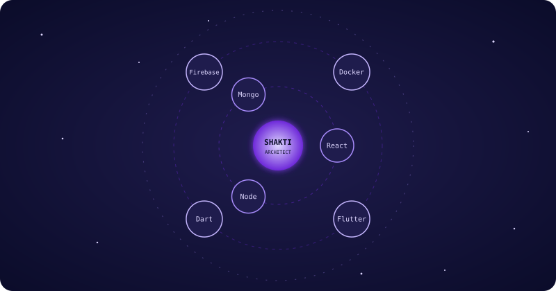
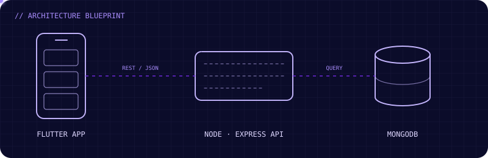

  

  <h2 align="center">🕯️ SEEKER OF THE ARCHITECT PATHWAY 🕯️</h2>

  

    
  

  

    <b>MERN Developer</b> based in India. I specialize in building <b>clean, scalable web architectures</b>   and <b>fluid mobile experiences</b> using Flutter.
  

  

  <h3>🌌 THE STACK OF POWER 🌌</h3>
  

    
  

  

    
  

  

  <h3>📊 ARCHITECT'S VITALITY</h3>
  

    
  

  

    
    
  

  

    
  

  

  <h3>🏛️ THE LIVING BLUEPRINT</h3>
  

    
  

  <h3>🐍 THE CODE PATHWAY</h3>
  

    
  

  

  <h3>🛡️ STATUS & RECOGNITION</h3>
  

    
    
    
  

  <h3>🔮 CONNECT WITH THE ARCHITECT</h3>
  

    
    &nbsp;
    
  

  

